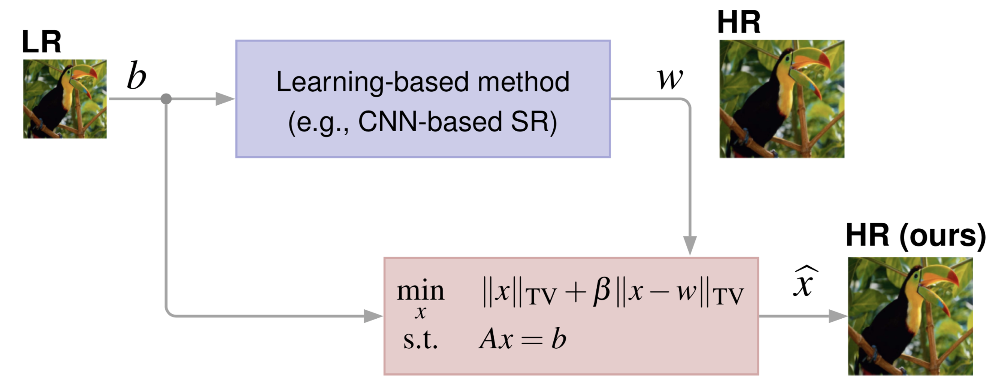
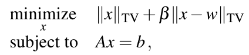
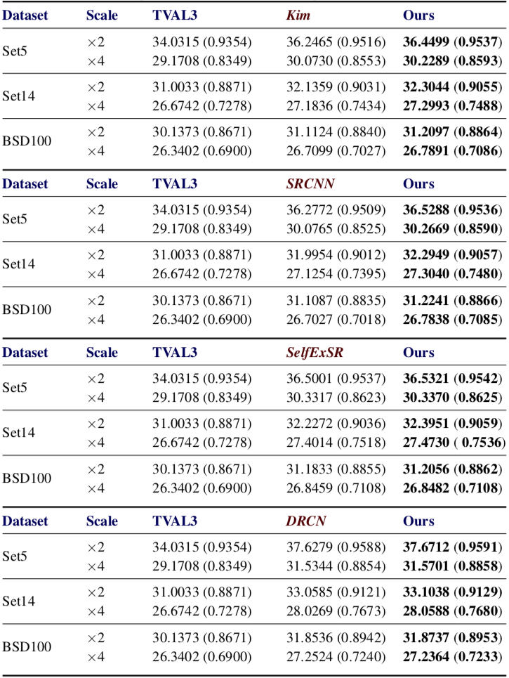

## Single Image Super-Resolution via CNN Architectures and TV-TV Minimization ##

### Introduction ### 
 
Matlab code that replicates the experiments in the paper:

**[Single Image Super-Resolution via CNN Architectures and TV-TV Minimization](https://arxiv.org/abs/1907.05380)** 
  Marija Vella, João F. C. Mota 
  BMVC 2019

The paper describes a post-processing step for any super-resolution algorithm, but which is particularly relevant for CNN-based algorithms.

Given a low-resolution image b and the 
output w of a super-resolution algorithm, the post-processing step 
produces an improved high-resolution image by solving TV-TV minimization:

Our experiments show that this procedure step systematically 
improves the quality of the reconstructed image, as measured by PSNR 
and SSIM, even when the base algorithms are state-of-the-art, (e.g., [Kim](https://www.ml.uni-saarland.de/people/kimki/pub/TPAMI2008-08-0554.R2SuperResolution.pdf), [SRCNN](http://mmlab.ie.cuhk.edu.hk/projects/SRCNN.html), [SelfExSR](https://www.cv-foundation.org/openaccess/content_cvpr_2015/papers/Huang_Single_Image_Super-Resolution_2015_CVPR_paper.pdf), [DRCN](https://cv.snu.ac.kr/research/DRCN/)).

### Requirements ###

* [Matlab](https://uk.mathworks.com/?s_tid=gn_logo) (tested for R2019a)
* [Image processing toolbox](https://uk.mathworks.com/products/image.html)

### Contents ###

There are 2 main folders: [images](https://github.com/marijavella/sr-tvtvsolver/tree/master/images) and [code](https://github.com/marijavella/sr-tvtvsolver/tree/master/code). 

The [images](https://github.com/marijavella/sr-tvtvsolver/tree/master/images) folder contains three subfolders:   

* [Test_Sets_GT](https://github.com/marijavella/sr-tvtvsolver/tree/master/images/Test_Sets_GT) -  Ground truth images from the datasets [Set5](https://drive.google.com/open?id=1QSNW3QWPThBC1eGTi8k9ArzpNOd4U1nT), [Set14](https://drive.google.com/drive/folders/1whyUJwPvXQ7O5QmTxY7nR-5jWtIHuz8w?usp=sharing), and [BSD100](https://drive.google.com/drive/folders/19vNKVva2Pi3IZ-S60OLD0DhuCVSIQhmB?usp=sharing); these are used for testing.

* [Test_Sets_Side ](https://github.com/marijavella/sr-tvtvsolver/tree/master/images/Test_Sets_Side) - Output images of the super-resolution methods we considered ([Kim](https://www.ml.uni-saarland.de/people/kimki/pub/TPAMI2008-08-0554.R2SuperResolution.pdf), [SRCNN](http://mmlab.ie.cuhk.edu.hk/projects/SRCNN.html), [SelfExSR](https://www.cv-foundation.org/openaccess/content_cvpr_2015/papers/Huang_Single_Image_Super-Resolution_2015_CVPR_paper.pdf) and [DRCN](https://cv.snu.ac.kr/research/DRCN/)). These were cropped to the appropriate size according to the scaling factor to avoid misalignment with the ground truth images. 

* [SampleImages](https://github.com/marijavella/sr-tvtvsolver/tree/master/images/SampleImages) - Contains two subfolders with sample images, one with the ground truth images and another with output images from SRCNN for an upscaling factor of 2x.

The [code](https://github.com/marijavella/sr-tvtvsolver/tree/master/code) folder contains the code required to run all the experiments. The script `experiments.m` executes a simple test; but if some lines are uncommented, all experiments in the paper are performed. The folder also contains two implementations of our solver, one optimized for GPUs and another for CPUs, and additional auxiliary code.

### Comparison with state-of-the-art Single-Image Super-Resolution methods ###

<strong>  Testing Datasets  </strong>  
 
The ground truth images used for all experiments were obtained <a href="https://github.com/jbhuang0604/SelfExSR">here</a>, and can also be found in the following links
 
 * <a href="https://drive.google.com/open?id=1QSNW3QWPThBC1eGTi8k9ArzpNOd4U1nT">Set5 Dataset</a>

 
 * <a href="https://drive.google.com/drive/folders/1whyUJwPvXQ7O5QmTxY7nR-5jWtIHuz8w?usp=sharing">Set14 Dataset</a>

 
 * <a href="https://drive.google.com/drive/folders/19vNKVva2Pi3IZ-S60OLD0DhuCVSIQhmB?usp=sharing">BSD100 Dataset</a>

 
 
<strong>  Testing Datasets used as side information  </strong>  
 
We used the following super-resolution methods for comparison and as 
base algorithms:
 
 | Method | Citation|
 |---- | ---|
 |**Kim**|K. I. Kim and Y. Kwon, “Single-image super-resolution using sparse regression and natural image prior”, IEEE Trans. Pattern Analysis and Machine Intelligence, vol. 32, no. 6, pp. 1127-1133, 2010. Code available [here](https://people.mpi-inf.mpg.de/~kkim/supres/supres.htm).|
 |**SRCNN**| C.Dong, C.C. Loy, K. He, X. Tang "Learning a Deep Convolutional Network for Image Super-Resolution, ECCV 2014. Code available [here](http://mmlab.ie.cuhk.edu.hk/projects/SRCNN.html).|
 |**SelfExSR**| J.Huang, A. Singh and N. Ahuja, "Single Image Super-Resolution from Transformed Self-Exemplars", CVPR 2015. Code available [here](https://github.com/marijavella/SelfExSR).|
  |**DRCN**| J. Kim, J. Kwon Lee and K.M. Lee, " Deeply-Recursive Convolutional Network for Image Super-Resolution", CVPR 2016. Code available [here](https://cv.snu.ac.kr/research/DRCN/).| 
 
For Kim, SRCNN and SelfExSR, we used output images available <a href="https://github.com/jbhuang0604/SelfExSR">here</a>. For DRCN, we used the output images made available by the authors themselves. The super-resolved images of the respective methods used as side information (w) in our method can be found in the following links:
 
* [Kim](https://drive.google.com/drive/folders/1Fy_X9d8-n0S-U3Iqq4mUdI79VYs7slsT?usp=sharing)

* [SRCNN](https://drive.google.com/drive/folders/1vvHMns56wQhG08b41WXwIYY74EHrUTOT?usp=sharing)

* [SelfExSR](https://drive.google.com/drive/folders/1eVvIMpDFfXGcNkK5xtfzGTInON5PziGW?usp=sharing)

* [DRCN](https://drive.google.com/drive/folders/1p0-5hmGNkoI0fvzUliaciVyFmmUJvt_V?usp=sharing)
 

<strong>  Quantitative Results  </strong>  
 
The values in the table represent PSNR and SSIM (in parenthesis), and 
the larger their value the better.

 

    
---

License: [ GPLv3 ]( https://www.gnu.org/licenses/gpl-3.0.en.html )
